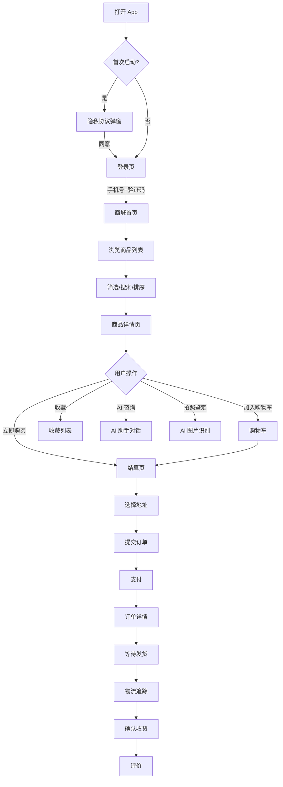
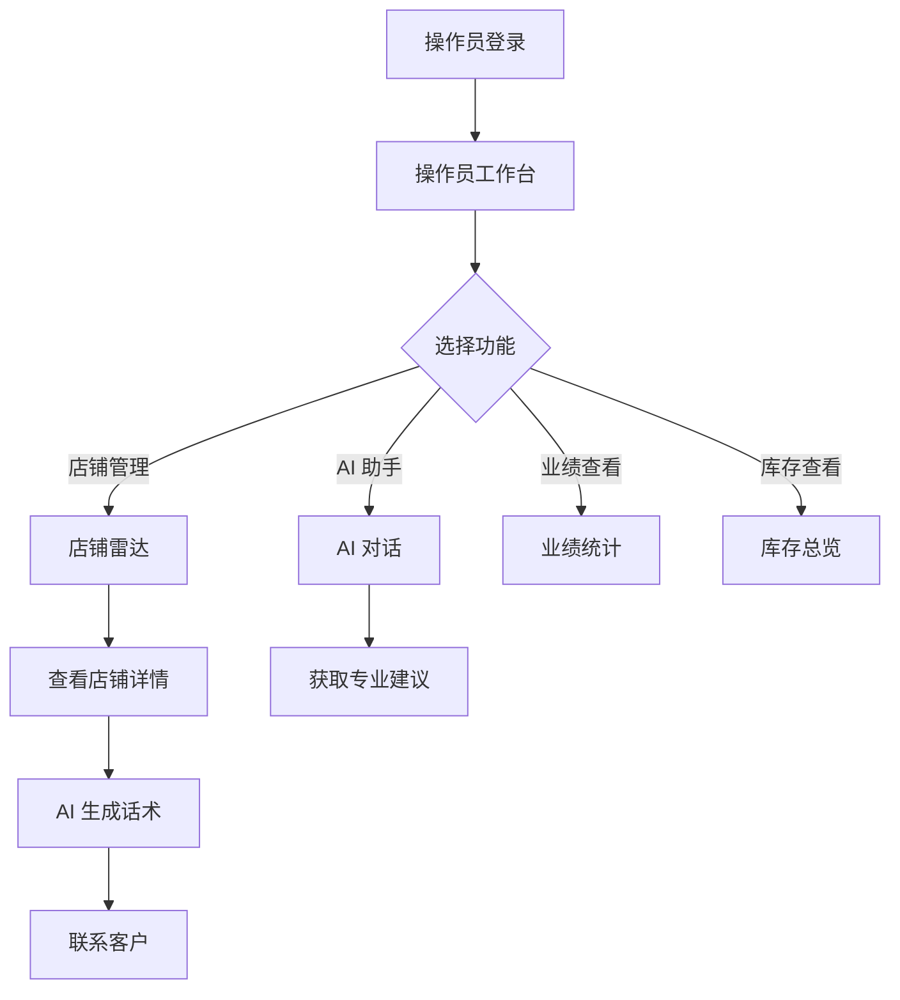
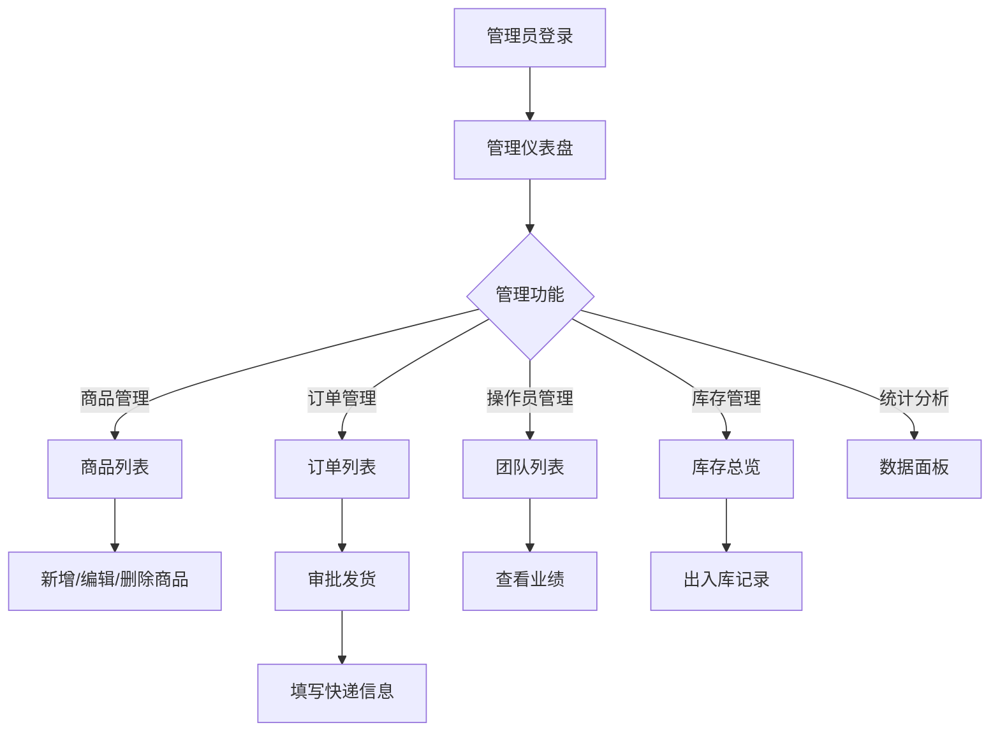
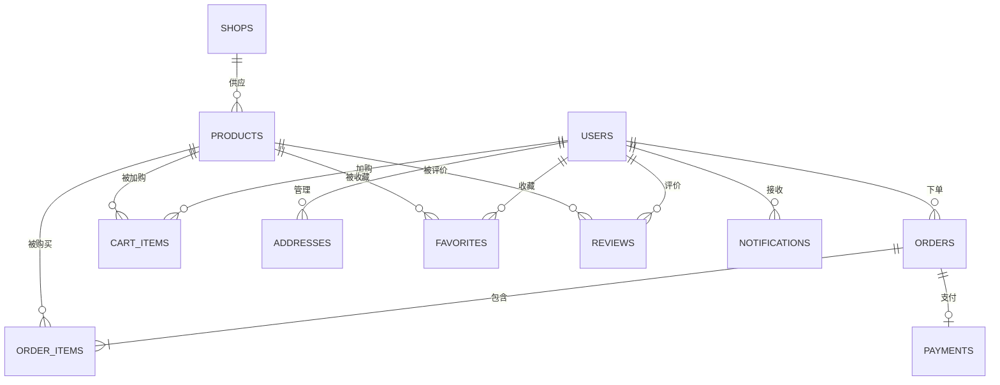
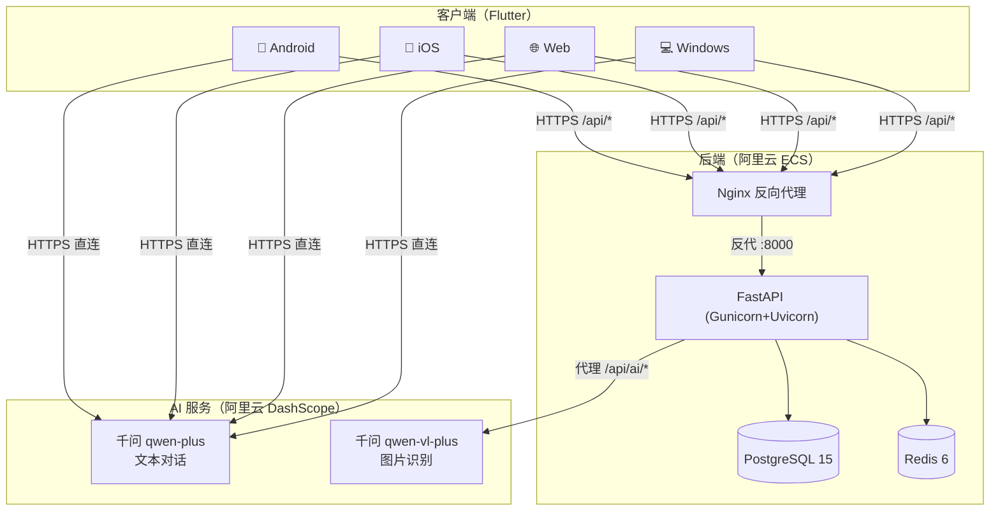
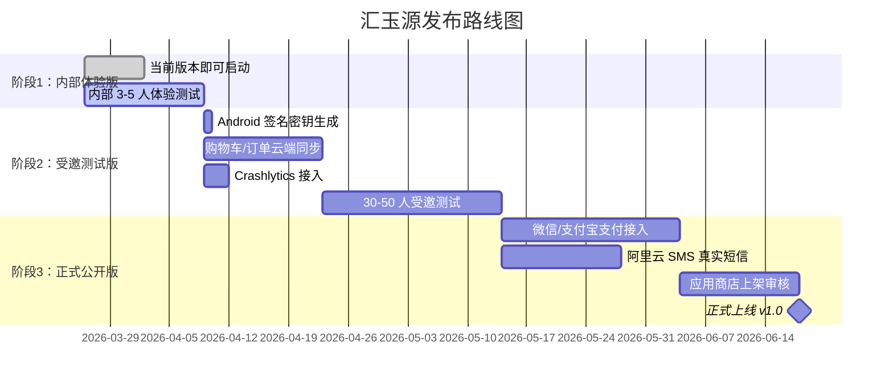

# 汇玉源珠宝智能交易平台 — 产品需求文档（PRD）

> **版本**：v1.0
> **日期**：2026-03-26
> **产品负责人**：汇玉源团队
> **开发团队**：全栈 Flutter + FastAPI + 5 Agent 协同
> **文档状态**：✅ 正式版

---

## 目录

1. [产品概述](#一产品概述)
2. [用户画像](#二用户画像)
3. [功能需求](#三功能需求)
4. [核心用户流程](#四核心用户流程)
5. [页面清单与信息架构](#五页面清单与信息架构)
6. [非功能需求](#六非功能需求)
7. [数据模型](#七数据模型)
8. [API 接口清单](#八api-接口清单)
9. [技术架构](#九技术架构)
10. [发布计划与风险](#十发布计划与风险)

---

## 一、产品概述

### 1.1 产品定位

**汇玉源**是一款面向 **珠宝行业 B2B2C** 的智能交易平台 App，连接**珠宝商家**（源头工厂/工作室）和**消费者**（收藏爱好者/礼品采购者），以 **AI 鉴赏+智能话术+行业大数据** 为核心差异化。

### 1.2 目标用户

| 用户类型 | 规模估计 | 核心需求 |
|---------|---------|---------|
| 珠宝消费者 | 千级 → 万级 | 便捷选购、正品保障、专家鉴赏 |
| 珠宝操作员/销售 | 十级 → 百级 | 客户管理、AI 话术、业绩统计 |
| 店铺管理员 | 数人 | 库存管理、数据分析、发货管理 |

### 1.3 核心价值主张

```
┌──────────────────────────────────────────────────────────────┐
│                     汇玉源核心价值                            │
├────────────────┬─────────────────┬───────────────────────────┤
│  🤖 AI 驱动     │  💎 行业专属     │  📱 全平台覆盖            │
│                │                 │                           │
│  • AI 对话鉴赏  │  • 130+ 珠宝品类 │  • Android / iOS          │
│  • 图片识别估价  │  • 15+ 材质分类  │  • Windows 桌面           │
│  • 智能话术生成  │  • 12+ 合作商家  │  • Web 浏览器             │
│  • 离线模式兜底  │  • 专业等级体系  │  • 深色/亮色双主题         │
└────────────────┴─────────────────┴───────────────────────────┘
```

### 1.4 竞品对比

| 维度 | 传统珠宝电商 | 综合平台(淘宝/京东) | **汇玉源** |
|------|-----------|-------------------|-----------|
| AI 智能对话 | ❌ | ❌ 基础客服 | ✅ 行业专家级 |
| AI 图片鉴定 | ❌ | ❌ | ✅ 千问 VL 识别 |
| 商家话术 AI | ❌ | ❌ | ✅ 自动生成 |
| 行业垂直度 | 🟡 部分 | ❌ 通用 | ✅ 珠宝专属 |
| 多角色支持 | ❌ | ❌ | ✅ 消费者/操作员/管理员 |
| 离线兜底 | ❌ | ❌ | ✅ 无网可用 |

---

## 二、用户画像

### 2.1 消费者用户

```
👩 张女士，35 岁，收藏爱好者
━━━━━━━━━━━━━━━━━━━━━━━━━━━━━
痛点：
 • 线下买珠宝怕被骗，无法判断真伪
 • 网上信息碎片化，难以系统学习鉴赏知识
 • 想了解一件珠宝的市场行情，找不到靠谱渠道

需求：
 ✅ 拍照上传即可 AI 鉴定材质和做工
 ✅ 与 AI 专家「玉小助」随时请教选购建议
 ✅ 浏览 130+ 精选珠宝，按材质/价格/产地筛选
 ✅ 暗色模式下夜间浏览、收藏比较
```

### 2.2 操作员/销售用户

```
👨 李先生，28 岁，珠宝销售新人
━━━━━━━━━━━━━━━━━━━━━━━━━━━━━━
痛点：
 • 不知道怎么和客户打招呼、跟进、报价
 • 客户问专业问题自己也答不上来
 • 管理多个平台(淘宝/抖音/小红书)的店铺数据麻烦

需求：
 ✅ AI 自动生成邀约/跟进/报价话术
 ✅ 店铺雷达查看合作商家业绩和数据
 ✅ 一键联系客户，记录沟通历史
 ✅ 查看个人业绩统计
```

### 2.3 管理员用户

```
👤 王老板，45 岁，珠宝工厂主
━━━━━━━━━━━━━━━━━━━━━━━━━━━━━
痛点：
 • 库存管理靠 Excel，容易出错
 • 不了解下游销售数据，补货靠经验
 • 多个操作员各自为战，缺少统一管理

需求：
 ✅ 实时查看商品库存、销售统计
 ✅ 管理操作员团队、查看业绩
 ✅ 一键审批发货、处理退货
 ✅ 商品增删改查、价格调整
```

---

## 三、功能需求

### 3.1 功能矩阵（按模块）

#### 🛒 商品模块

| 功能 | 优先级 | 状态 | 说明 |
|------|--------|------|------|
| 商品列表浏览 | P0 | ✅ | 分页加载、卡片展示、骨架屏 |
| 分类筛选 | P0 | ✅ | 按材质（和田玉/翡翠/南红等 15+ 分类） |
| 搜索功能 | P0 | ✅ | 名称/材质/分类/编号/产地/描述多维搜索 |
| 排序 | P0 | ✅ | 综合/价格/销量排序 |
| 商品详情 | P0 | ✅ | 多图轮播、规格参数、AI 描述生成 |
| 收藏 | P1 | ✅ | 收藏/取消收藏/收藏列表 |
| 浏览记录 | P2 | ✅ | 自动记录、按日期分组、可清空 |

#### 🛍️ 交易模块

| 功能 | 优先级 | 状态 | 说明 |
|------|--------|------|------|
| 购物车 | P0 | ✅ | 增删改查、数量调整、小计 |
| 结算下单 | P0 | ✅ | 选择地址、生成订单 |
| 订单管理 | P0 | ✅ | 创建/支付/发货/收货/取消/退款 |
| 订单详情 | P0 | ✅ | 状态流程图、商品信息、物流追踪 |
| 微信/支付宝支付 | P0 | ❌ | 需企业资质，当前模拟支付 |
| 物流查询 | P1 | ❌ | 需对接快递 100 API |

#### 🤖 AI 模块

| 功能 | 优先级 | 状态 | 说明 |
|------|--------|------|------|
| AI 对话（文本） | P0 | ✅ | DashScope 千问流式输出 |
| AI 图片鉴定 | P0 | ✅ | DashScope qwen-vl，后端代理 |
| 快捷问答模板 | P1 | ✅ | 预设珠宝行业常见问题 |
| AI 话术生成 | P1 | ✅ | 操作员邀约/跟进/报价话术 |
| AI 产品描述 | P1 | ✅ | 自动优化商品文案 |
| 离线兜底 | P0 | ✅ | API 不可用时切换本地预设回答 |

#### 👤 用户模块

| 功能 | 优先级 | 状态 | 说明 |
|------|--------|------|------|
| 三角色登录 | P0 | ✅ | 管理员/操作员/消费者 |
| SMS 验证码登录 | P0 | 🟡 | 万能码 8888 可用，真实短信需资质 |
| 个人中心 | P1 | ✅ | 用户信息、资产统计、功能入口 |
| 收货地址管理 | P1 | ✅ | 增删改查、默认地址、省市区三级联动 |
| 隐私协议弹窗 | P0 | ✅ | 首次启动强制同意 |

#### 📊 管理模块

| 功能 | 优先级 | 状态 | 说明 |
|------|--------|------|------|
| 统计仪表盘 | P0 | ✅ | 订单/销售/用户 KPI 统计 |
| 商品管理 | P0 | ✅ | CRUD + 图片管理 |
| 操作员管理 | P1 | ✅ | 查看团队/业绩 |
| 库存管理 | P1 | ✅ | 库存总览/出入库/统计 |
| 发货管理 | P1 | ✅ | 9 大快递选择、物流时间线 |

#### 📱 平台功能

| 功能 | 优先级 | 状态 | 说明 |
|------|--------|------|------|
| 深色/亮色主题 | P1 | ✅ | 全页面适配 |
| 多语言 | P2 | ✅ | 简中/繁中/英文 |
| 通知中心 | P1 | ✅ | 订单/活动/系统通知 Tab |
| 推送通知 | P2 | ❌ | 需接入 Firebase/极光 |

### 3.2 功能完成率统计

```
总功能点: 35 项
━━━━━━━━━━━━━━━━━━━━━━━━━━
✅ 已完成:    29 项 (83%)
🟡 部分完成:   2 项 (6%)
❌ 未完成:     4 项 (11%)
━━━━━━━━━━━━━━━━━━━━━━━━━━
阻塞未完成项均为外部资质依赖（支付/短信/推送/物流）
```

---

## 四、核心用户流程

### 4.1 消费者购物流程



### 4.2 操作员工作流程



### 4.3 管理员管理流程



---

## 五、页面清单与信息架构

### 5.1 全量页面清单（24 个）

| # | 页面 | 文件 | 角色 |
|---|------|------|------|
| 1 | 登录页 | `login_screen.dart` | 全角色 |
| 2 | 商城首页 | `home_screen.dart` | 消费者 |
| 3 | 商品列表 | `product_list_screen.dart` | 消费者 |
| 4 | 商品详情 | `product_detail_screen.dart` | 消费者 |
| 5 | 商品搜索 | `search_screen.dart` | 消费者 |
| 6 | 购物车 | `cart_screen.dart` | 消费者 |
| 7 | 结算页 | `checkout_screen.dart` | 消费者 |
| 8 | 订单列表 | `order_list_screen.dart` | 消费者 |
| 9 | 订单详情 | `order_detail_screen.dart` | 消费者 |
| 10 | 收藏列表 | `favorite_list_screen.dart` | 消费者 |
| 11 | 浏览记录 | `browse_history_screen.dart` | 消费者 |
| 12 | AI 助手 | `ai_assistant_screen.dart` | 全角色 |
| 13 | 个人中心 | `profile_screen.dart` | 全角色 |
| 14 | 地址管理 | `address_list_screen.dart` | 消费者 |
| 15 | 通知中心 | `notification_screen.dart` | 全角色 |
| 16 | 收款账户 | `payment_accounts_screen.dart` | 操作员 |
| 17 | 操作员工作台 | `operator_home.dart` | 操作员 |
| 18 | 店铺雷达 | `shop_radar.dart` | 操作员 |
| 19 | 店铺详情 | `shop_detail_screen.dart` | 操作员 |
| 20 | 管理员仪表盘 | `admin_dashboard.dart` | 管理员 |
| 21 | 隐私政策 | `privacy_policy_screen.dart` | 全角色 |
| 22 | 用户协议 | `user_agreement_screen.dart` | 全角色 |
| 23 | AR 试戴 | `ar_try_on_screen.dart` | 消费者 |
| 24 | 物流详情 | `logistics_screen.dart` | 消费者 |

### 5.2 信息架构

```
汇玉源 App
├── 🔐 入口层
│   ├── 启动页（SplashScreen）
│   ├── 隐私弹窗（首次启动）
│   └── 登录页（三角色 Tab）
│
├── 🛒 消费者视图（底部4Tab）
│   ├── Tab1: 商城首页
│   │   ├── 轮播广告区
│   │   ├── 商品列表（分类/筛选/排序）
│   │   └── 搜索入口
│   ├── Tab2: AI 助手
│   │   ├── 对话列表
│   │   ├── 快捷问答
│   │   └── 图片识别
│   ├── Tab3: 购物车
│   │   ├── 商品列表
│   │   └── 结算入口
│   └── Tab4: 我的
│       ├── 个人信息
│       ├── 订单列表 → 订单详情 → 物流
│       ├── 收藏列表
│       ├── 浏览记录
│       ├── 地址管理
│       ├── 通知中心
│       └── 设置（主题/语言/关于）
│
├── 👔 操作员视图（底部4Tab）
│   ├── Tab1: 操作员工作台
│   │   ├── 业绩统计卡片
│   │   ├── 待办事项
│   │   └── 快捷操作
│   ├── Tab2: AI 助手（共用）
│   ├── Tab3: 店铺雷达 → 店铺详情
│   └── Tab4: 我的（共用）
│
└── 📊 管理员视图（底部4Tab）
    ├── Tab1: 管理仪表盘
    │   ├── 总览 Tab（统计卡片+活动流）
    │   ├── 商品管理 Tab（增删改查）
    │   └── 操作员 Tab（团队/业绩）
    ├── Tab2: AI 助手（共用）
    ├── Tab3: 库存管理
    └── Tab4: 我的（共用）
```

---

## 六、非功能需求

### 6.1 性能要求

| 指标 | 目标值 | 当前状态 |
|------|--------|---------|
| 冷启动时间 | ≤ 3s | ✅ 已达标 |
| 页面切换 | ≤ 200ms | ✅ 已达标 |
| 商品列表首屏 | ≤ 1.5s | ✅ 骨架屏+懒加载 |
| AI 首字响应 | ≤ 2s | ✅ 流式 SSE |
| API 超时 | 连接 15s / 接收 30s | ✅ 已配置 |
| 内存占用 | ≤ 200MB | ✅ 单例+限额机制 |
| APK 体积 | ≤ 80MB（Release） | ⚠️ Debug 148MB |

### 6.2 安全要求

| 要求 | 状态 | 说明 |
|------|------|------|
| Token 加密存储 | ✅ | `flutter_secure_storage` |
| JWT + bcrypt | ✅ | 后端认证 |
| CORS 白名单 | ✅ | 后端配置 |
| SMS 限流 | ✅ | Redis 60s冷却/日10次 |
| API Key 不入库 | ✅ | `--dart-define` 注入 |
| HTTPS | ✅ | 域名已启用 SSL |
| 隐私合规 | ✅ | PIPL 合规弹窗 |
| SSL Pinning | ❌ | 后续迭代 |

### 6.3 兼容性

| 平台 | 最低版本 | 状态 |
|------|---------|------|
| Android | 5.0（API 21） | ✅ |
| iOS | 12.0 | ⚠️ 未测试 |
| Web | Chrome/Edge/Safari | ✅ |
| Windows | 10/11 | ✅ |

### 6.4 可用性

| 要求 | 状态 |
|------|------|
| 深色/亮色模式 | ✅ 全页面适配 |
| 中/英/繁三语 | ✅ |
| 骨架屏加载 | ✅ 所有列表页 |
| 空状态提示 | ✅ 购物车/搜索/订单等 |
| 错误重试 | ✅ 全局错误页 |
| 离线降级 | ✅ AI/商品均有 fallback |

---

## 七、数据模型

### 7.1 核心实体关系



### 7.2 数据库表（PostgreSQL，13 张）

| 表名 | 说明 | 关键字段 |
|------|------|---------|
| `users` | 用户表 | id, phone, user_type, nickname, avatar |
| `products` | 商品表 | id, name, category, material, price, stock, images(JSONB) |
| `orders` | 订单表 | id, user_id, status, total, address_snap(JSONB) |
| `order_items` | 订单商品 | order_id, product_id, quantity, price |
| `cart_items` | 购物车 | user_id, product_id, quantity |
| `addresses` | 收货地址 | user_id, province, city, district, detail, is_default |
| `favorites` | 收藏 | user_id, product_id |
| `reviews` | 评价 | user_id, product_id, rating, content |
| `payments` | 支付记录 | order_id, method, status, amount |
| `sms_logs` | 短信日志 | phone, code, expires_at |
| `shops` | 店铺 | platform, category, contact_status |
| `devices` | 推送设备 | user_id, device_token, platform |
| `notifications` | 通知 | user_id, title, body, type, is_read |

---

## 八、API 接口清单

### 8.1 API 概览

- **总端点数**：55 HTTP + 1 WebSocket
- **认证方式**：JWT Bearer Token
- **数据格式**：JSON，UTF-8
- **基础路径**：`/api/`

### 8.2 接口分组

#### 认证（5 个端点）

| 方法 | 路径 | 说明 |
|------|------|------|
| POST | `/api/auth/login` | 登录（三角色） |
| POST | `/api/auth/send-sms` | 发送验证码 |
| POST | `/api/auth/verify-sms` | 验证码登录 |
| POST | `/api/auth/logout` | 登出 |
| POST | `/api/auth/refresh` | 刷新 Token |

#### 商品（6 个端点）

| 方法 | 路径 | 说明 |
|------|------|------|
| GET | `/api/products` | 商品列表（分页/筛选/排序） |
| GET | `/api/products/{id}` | 商品详情 |
| POST | `/api/products` | 创建商品（管理员） |
| PUT | `/api/products/{id}` | 更新商品（管理员） |
| DELETE | `/api/products/{id}` | 删除商品（管理员） |

#### 订单（11 个端点）

| 方法 | 路径 | 说明 |
|------|------|------|
| GET | `/api/orders` | 订单列表 |
| POST | `/api/orders` | 创建订单 |
| GET | `/api/orders/{id}` | 订单详情 |
| POST | `/api/orders/{id}/pay` | 支付订单 |
| POST | `/api/orders/{id}/cancel` | 取消订单 |
| POST | `/api/orders/{id}/confirm-receipt` | 确认收货 |
| POST | `/api/orders/{id}/refund` | 申请退款 |
| GET | `/api/orders/{id}/logistics` | 物流查询 |
| GET | `/api/orders/stats` | 订单统计 |
| POST | `/api/admin/orders/{id}/ship` | 管理员发货 |

#### 购物车（4 个端点）

| 方法 | 路径 | 说明 |
|------|------|------|
| GET | `/api/cart` | 购物车列表 |
| POST | `/api/cart` | 添加商品 |
| PUT | `/api/cart/{product_id}` | 更新数量 |
| DELETE | `/api/cart/{product_id}` | 删除商品 |

#### 用户 / 地址 / 收藏 / 评价 / 通知 / AI / 上传 / WebSocket

（详见后端 Swagger 文档 `http://服务器:8000/docs`）

---

## 九、技术架构

### 9.1 系统架构全景



### 9.2 技术栈

| 层级 | 技术 | 版本 |
|------|------|------|
| **前端框架** | Flutter / Dart | 3.27+ / 3.6+ |
| **状态管理** | Riverpod | AsyncNotifier 模式 |
| **HTTP** | Dio | 5.4+ |
| **安全存储** | flutter_secure_storage | — |
| **后端框架** | FastAPI + Pydantic v2 | Python 3.11+ |
| **数据库** | PostgreSQL | 15+ |
| **缓存/限流** | Redis | 6+ |
| **Web 服务器** | Nginx + Gunicorn | — |
| **AI 文本** | DashScope qwen-plus | 流式 SSE |
| **AI 视觉** | DashScope qwen-vl-plus-latest | 后端代理 |
| **CI/CD** | GitHub Actions | Flutter 3.32 + Java 17 |
| **部署** | 阿里云 ECS + systemd | 2核 / 4GB |

---

## 十、发布计划与风险

### 10.1 三阶段发布路线



### 10.2 风险评估

| 风险 | 概率 | 影响 | 缓解措施 |
|------|------|------|---------|
| 支付资质审核慢 | 🟡 中 | 🔴 高 | 先上线展示版，支付后补；保留模拟支付调试链路 |
| SMS 模板审核失败 | 🟡 中 | 🟡 中 | 保留万能验证码 8888 开发模式 |
| iOS 开发者账号 | 🟡 中 | 🟡 中 | 先发 Android + Web，iOS 后续 |
| 应用商店审核被拒 | 🔵 低 | 🟡 中 | 隐私政策/用户协议已准备 |
| 服务器扩容 | 🔵 低 | 🔵 低 | 当前 2 核 4GB，50 人内测够用 |

### 10.3 成功指标（v1.0 上线后 3 个月）

| 指标 | 目标 |
|------|------|
| 注册用户 | ≥ 500 |
| 日活用户(DAU) | ≥ 50 |
| AI 对话次数/日 | ≥ 100 |
| 订单转化率 | ≥ 3% |
| 用户留存(7日) | ≥ 30% |
| 崩溃率 | ≤ 0.5% |
| API P99 响应 | ≤ 2s |

---

*文档版本: 1.0 | 创建: 2026-03-26 | 基于 v4.0 代码库实际状态编写*
