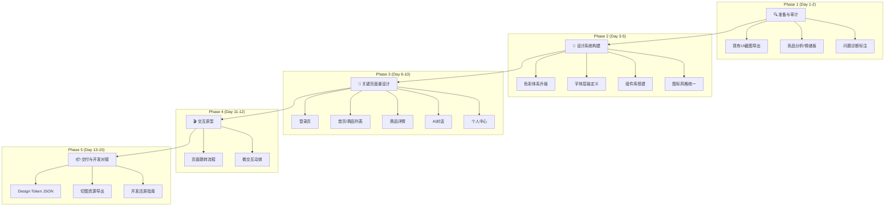

# 汇玉源 App — Figma UI 重设计执行计划

> **目标**：从根本上消除"AI 味"，建立珠宝行业专属的"温润·通透·奢华"品牌视觉体系  
> **预计周期**：10-15 个工作日（可分阶段推进）  
> **创建日期**：2026-04-13

---

## 📋 整体流程总览



---

## Phase 1: 准备与审计（Day 1-2）

### Step 1.1: 现有 UI 截图导出

**操作**：在 Windows 桌面端或 Android 真机上运行 App，逐页截图。

**需要截图的页面清单**（按优先级排序）：

| 序号 | 页面 | 对应文件 | 优先级 |
|------|------|----------|--------|
| 1 | 登录页 | `screens/login_screen.dart` | ⭐⭐⭐ |
| 2 | 主页/首页 | `screens/main_screen.dart` | ⭐⭐⭐ |
| 3 | 商品搜索/列表 | `screens/product/search_screen.dart` | ⭐⭐⭐ |
| 4 | AI 对话界面 | `screens/chat/` | ⭐⭐⭐ |
| 5 | 商品详情 | `screens/product/` 相关 | ⭐⭐ |
| 6 | 购物车 | `screens/order/` 相关 | ⭐⭐ |
| 7 | 个人中心 | `screens/profile/` | ⭐⭐ |
| 8 | 操作员面板 | `screens/operator/` | ⭐ |
| 9 | 管理后台 | `screens/admin/` | ⭐ |
| 10 | 支付页面 | `screens/payment/` | ⭐ |

> [!TIP]
> **快捷方式**：运行 `flutter run -d windows`，用 Win+Shift+S 截图，按 `HYY_01_登录.png` 格式命名

### Step 1.2: 竞品分析与情绪板（Moodboard）

在 Figma 中创建一个 Moodboard 页面，收集以下参考：

| 类别 | 参考对象 | 关注点 |
|------|----------|--------|
| **传统珠宝** | 周大福 App、周生生 App | 色彩克制、卡片排版、产品展示 |
| **奢侈品电商** | Tiffany & Co.、Cartier | 极简留白、字体选用、品牌气质 |
| **精品电商** | 得物 App、寺库 | 暗色模式、商品卡片、价格展示 |
| **设计灵感** | Dribbble `jewelry app` 关键词 | 创意布局、动效灵感 |
| **AI产品** | ChatGPT、Kimi | 对话界面、输入框设计 |

**Figma 操作**：
1. 新建 Page → 命名为 `Moodboard`
2. 创建多个 Frame（1440×900），分类粘贴截图
3. 用文字标注每个参考的"可借鉴点"

### Step 1.3: 问题诊断标注

将现有 UI 截图导入 Figma，用红色标注框标记所有"AI 味"问题：

当前已知的核心问题（参照 `ui_optimization_strategies.md` 诊断）：

1. ❌ **主色 `#2E8B57` 使用过于直白** — 缺少色阶过渡和透明度层次
2. ❌ **组件 Material 默认感重** — 按钮、输入框缺乏定制
3. ❌ **动效缺失** — 页面切换单调
4. ❌ **排版节奏均匀** — 字号跳跃不明显，视觉无焦点
5. ❌ **图标风格混杂** — 线条粗细不一
6. ❌ **微交互贫乏** — 点击/加载反馈单调

---

## Phase 2: 设计系统构建（Day 3-5）

### Step 2.1: 色彩体系升级

> [!IMPORTANT]
> 这是去"AI味"最关键的一步。从机械纯色升级为有层次感的色阶体系。

#### 新色彩体系定义

**主色 — 翡翠绿色阶（Emerald Scale）**

| Token | 色值 | 用途 |
|-------|------|------|
| `emerald-50` | `#ECFDF5` | 最浅底色 / 成功提示背景 |
| `emerald-100` | `#D1FAE5` | 悬浮态 / 选中态背景 |
| `emerald-200` | `#A7F3D0` | 标签背景 / 次级背景 |
| `emerald-300` | `#6EE7B7` | 进度条 / 图表 |
| `emerald-400` | `#34D399` | 次级按钮 / 链接 |
| `emerald-500` | `#10B981` | ✅ **主按钮** / 主操作 |
| `emerald-600` | `#059669` | 按钮 Hover 态 |
| `emerald-700` | `#047857` | 按钮 Active/Pressed 态 |
| `emerald-800` | `#065F46` | 深色文字 / 标题 |
| `emerald-900` | `#064E3B` | 最深色 / 暗色模式强调 |

**辅助色 — 金色渐变**

| Token | 色值 | 用途 |
|-------|------|------|
| `gold-light` | `#F4E4BC` | 渐变起点 / 浅金 |
| `gold-mid` | `#D4AF37` | 渐变中点 / 品牌金 |
| `gold-deep` | `#B8941F` | 渐变终点 / 深金 |
| `gold-gradient` | `linear(#F4E4BC → #D4AF37 → #B8941F)` | 金色渐变（价格/CTA） |

**暗色背景体系**

| Token | 色值 | 用途 |
|-------|------|------|
| `dark-bg-primary` | `#0D1117` | 主背景（GitHub 深色风） |
| `dark-bg-secondary` | `#161B22` | 次级背景 / 卡片 |
| `dark-bg-tertiary` | `#21262D` | 悬浮层 / 弹窗 |
| `dark-border` | `rgba(255,255,255,0.08)` | 分割线 / 边框 |
| `dark-glass` | `rgba(255,255,255,0.06)` | 毛玻璃填充 |

**语义色**

| Token | 色值 | 用途 |
|-------|------|------|
| `success` | `#10B981` | 成功（复用主色） |
| `warning` | `#F59E0B` | 警告 |
| `error` | `#EF4444` | 错误 |
| `info` | `#3B82F6` | 信息 |
| `price` | `#E53935` | 价格红 |

**Figma 操作**：
1. 打开 `Local Styles` → `Color Styles`
2. 按 `Color/Emerald/500` 格式逐一创建
3. 用 `Gradient Fill` 创建金色和暗色渐变
4. 建议安装 Figma 插件 **Styler** 批量管理

### Step 2.2: 字体层级定义

采用 **Major Third 1.25 倍率**：

| 层级 | 字号 | 字重 | 行高 | 用途 |
|------|------|------|------|------|
| Display | 32px | Bold (700) | 1.2 | 页面主标题 |
| H1 | 24px | SemiBold (600) | 1.2 | 模块标题 |
| H2 | 20px | Medium (500) | 1.3 | 卡片标题 |
| Body Large | 16px | Regular (400) | 1.5 | 正文 |
| Body | 14px | Regular (400) | 1.5 | 次级正文 |
| Caption | 12px | Regular (400) | 1.4 | 辅助说明 |
| Small | 10px | Medium (500) | 1.2 | 角标 / Badge |

**字体选用**：
- 中文标题：**思源黑体 / Noto Sans SC**（Medium-Bold）
- 英文标题：**Cormorant**（衬线体 — 奢华感）
- 正文：**Montserrat / Noto Sans SC**（无衬线 — 可读性）
- 价格数字：**DIN Pro / Montserrat Bold**（等宽数字 — 对齐感）

**Figma 操作**：
1. `Text Styles` 中按 `Text/Display`、`Text/H1` 等创建
2. 安装 Google Fonts 插件加载 Cormorant + Montserrat

### Step 2.3: 核心组件库搭建

在 Figma 中用 **Component Variants** 构建以下组件：

#### 组件清单

| 组件 | 变体数 | 状态 |
|------|--------|------|
| **Button** | 7 | Default / Hover / Pressed / Disabled / Loading × Primary / Secondary / Ghost / Danger |
| **Input** | 5 | Default / Focused / Error / Disabled / With-Icon |
| **Card** | 6 | Product / Glass / Info / Stats / AI Chat Bubble / Order |
| **Navigation** | 3 | Bottom Tab / Top AppBar / Side Drawer |
| **Badge** | 4 | Status / Count / Label / Material-Tag |
| **Avatar** | 3 | User / AI Assistant / Shop |
| **Search Bar** | 2 | Default / Active |
| **Price Tag** | 2 | Normal / Discounted |
| **Loading** | 3 | Skeleton / Spinner / Shimmer |

#### 按钮设计规范（示例）

**Primary Button**：
- 背景：`Linear Gradient: emerald-500 → emerald-600`
- 圆角：`12px`
- 内边距：`16px 24px`
- 阴影：`0 4px 12px rgba(16,185,129,0.3)`
- 文字：`Body Large / Bold / White`
- Hover：阴影扩大 + 亮度 +5%
- Pressed：缩小至 `scale(0.97)` + 阴影收缩

**Glass Card**：
- 背景：`rgba(255,255,255,0.06)`
- 模糊：`backdrop-blur: 20px`
- 边框：`1px solid rgba(255,255,255,0.12)`
- 圆角：`16px`
- 阴影：`0 8px 32px rgba(0,0,0,0.2)` + `inset 0 1px 0 rgba(255,255,255,0.08)`

### Step 2.4: 图标风格统一

**风格定义**：
- 线条粗细：**2px**
- 端点：**圆角（Round Cap）**
- 连接处：**圆角（Round Join）**
- 风格：**Rounded Line + Duotone**

**推荐图标库**：
- [Phosphor Icons](https://phosphoricons.com/) — 圆润现代，支持双色
- [Lucide](https://lucide.dev/) — 简洁通用
- 自定义：珠宝相关图标（玉石、鉴定证书、秤）需手动绘制

**Figma 操作**：
1. 安装 Figma 插件 **Iconify** 或 **Phosphor Icons**
2. 导入所需图标到 `Icons` 组件页
3. 统一调整为 24×24，2px 描边

---

## Phase 3: 关键页面重设计（Day 6-10）

### 3.1 登录页重设计

**设计要点**：

| 元素 | 当前 | 重设计 |
|------|------|--------|
| 背景 | 纯色/简单渐变 | 深色渐变 + 5% 玉石纹理 SVG 叠加 + 翡翠光晕 |
| Logo | 简单居中 | 带金色光泽渐变 + 微动效（呼吸光） |
| 输入框 | 标准 Material | 半透明毛玻璃 + 绿色聚焦发光边框 + 左侧图标 |
| 按钮 | 纯色矩形 | 翡翠渐变 + Shimmer 光效 + 12px 圆角 |
| 第三方登录 | 方形图标 | 圆形毛玻璃容器 + 品牌色图标 |
| 装饰 | 无 | 顶部金色波浪线 + 底部翡翠色光斑 |

**视觉层次**（从上到下）：
1. 金色装饰波浪（SVG，10% 透明度）
2. Logo + 品牌名（32px Display + 金色渐变）
3. 欢迎语（20px H2 + 翡翠绿）
4. 手机号输入框（Glass Input）
5. 验证码输入框（Glass Input + 倒计时按钮）
6. 登录按钮（Primary Gradient + Shimmer）
7. 分割线 "或"
8. 第三方登录图标（3个圆形 Glass 容器）
9. 条款链接（Caption / 次级文字色）

### 3.2 首页重设计

**设计要点**：

| 区域 | 重设计方案 |
|------|-----------|
| 顶部搜索栏 | 毛玻璃搜索框 + AI 搜索图标（渐变发光） |
| Banner 轮播 | 全宽圆角卡片 + 渐变文字叠加 + 自动播放 |
| 分类入口 | 圆形图标网格（双色 Icon + 材质名）→ 2行4列 |
| 推荐商品 | 瀑布流双列布局 + 商品卡片（毛玻璃 + 价格渐变底栏） |
| 底部导航 | 5 Tab + 中间凸出 AI 按钮（翡翠光圈） |

**商品卡片规范**：
- 图片区：`16:12` 比例，圆角 `12px`（顶部）
- 信息区：商品名（H2/14px/2行内）+ 材质标签（Badge）+ 价格（DIN Bold/红色）
- 底栏：半透明渐变叠加 → 收藏按钮 + 评分星级

### 3.3 商品详情页重设计

**关键改造**：
- 图片画廊：全宽沉浸式 + 底部渐变遮罩 + 缩略图切换
- 价格区：金色渐变文字 + 原价删除线 + 折扣 Badge
- 参数区：网格布局（材质 / 产地 / 尺寸 / 证书号）
- 购买栏：底部固定 → 毛玻璃背景 + 渐变"立即购买"按钮

### 3.4 AI 对话界面重设计

**改造重点**：

| 元素 | 重设计 |
|------|--------|
| 顶栏 | AI 助手头像（玉质纹理）+ 名字"玉小智" + 在线状态点 |
| AI 消息 | 半透明翡翠绿气泡 + 左圆角 + 打字机逐字效果 |
| 用户消息 | 右对齐深色渐变气泡 + 右圆角 |
| 输入区 | 毛玻璃输入框 + 语音按钮 + 图片按钮 + 发送按钮 |
| 快捷短语 | 底部横向滚动 Chips（"鉴定宝石"、"推荐翡翠"） |
| 空状态 | 大号 AI Logo + "有什么可以帮您？" + 3个引导卡片 |

### 3.5 个人中心重设计

**改造重点**：
- 顶部：用户大头像 + 会员等级 Badge（金色渐变）
- 功能入口：4列网格（我的订单/收藏/足迹/优惠券）
- 卡片区：Glass Card 风格的功能模块
- 底部：设置/关于/联系客服

---

## Phase 4: 交互原型（Day 11-12）

### 4.1 页面跳转流程

在 Figma 中使用 **Prototype** 功能串联所有页面：

| 流程 | 交互方式 | 动效 |
|------|----------|------|
| 登录 → 首页 | 点击登录按钮 | `Smart Animate` + `Ease Out 300ms` |
| 首页 → 商品详情 | 点击商品卡片 | `Push Right 300ms` + 图片 `Hero` 过渡 |
| 首页 → AI 对话 | 点击底部 AI 按钮 | `Slide Up 400ms` + 弹性曲线 |
| 商品详情 → 购物车 | 点击"加入购物车" | 商品图片飞入购物车图标 + 数量 Badge 弹跳 |
| 任意 → 搜索 | 点击搜索框 | `Fade In 200ms` + 键盘弹出 |

### 4.2 微交互动效设计

| 交互 | 效果描述 | 时长 |
|------|----------|------|
| 收藏按钮 | 心形放大 1.3x → 回弹 + 金色粒子飞散 | 400ms |
| 加入购物车 | 商品缩略图沿抛物线飞入 Tab 图标 | 600ms |
| 下拉刷新 | 翡翠色水滴动画 + "正在刷新" | 根据网络 |
| 加载骨架屏 | 珠光 Shimmer 从左到右扫过 | 1.5s 循环 |
| Tab 切换 | 图标从线性变实心 + 文字淡入 | 200ms |
| AI 打字 | 三点弹跳 → 文字逐字出现 | 20ms/字符 |
| 按钮点击 | scale(0.97) → scale(1.0) 回弹 | 150ms |

---

## Phase 5: 交付与开发对接（Day 13-15）

### 5.1 Design Token JSON 导出

使用 Figma 插件 **Design Tokens** 或 **Tokens Studio** 导出：

```json
{
  "color": {
    "emerald": {
      "50": "#ECFDF5",
      "100": "#D1FAE5",
      "200": "#A7F3D0",
      "300": "#6EE7B7",
      "400": "#34D399",
      "500": "#10B981",
      "600": "#059669",
      "700": "#047857",
      "800": "#065F46",
      "900": "#064E3B"
    },
    "gold": {
      "light": "#F4E4BC",
      "mid": "#D4AF37",
      "deep": "#B8941F"
    },
    "dark": {
      "bg-primary": "#0D1117",
      "bg-secondary": "#161B22",
      "bg-tertiary": "#21262D"
    }
  },
  "spacing": {
    "xs": 4, "sm": 8, "md": 12, "lg": 16,
    "xl": 20, "xxl": 24, "xxxl": 32
  },
  "radius": {
    "sm": 8, "md": 12, "lg": 16, "xl": 20, "pill": 999
  },
  "shadow": {
    "card": "0 4px 12px rgba(0,0,0,0.08)",
    "elevated": "0 8px 32px rgba(0,0,0,0.2)",
    "glow-emerald": "0 0 20px rgba(16,185,129,0.4)",
    "glow-gold": "0 0 20px rgba(212,175,55,0.4)"
  },
  "typography": {
    "display": { "size": 32, "weight": 700, "lineHeight": 1.2 },
    "h1": { "size": 24, "weight": 600, "lineHeight": 1.2 },
    "h2": { "size": 20, "weight": 500, "lineHeight": 1.3 },
    "body-lg": { "size": 16, "weight": 400, "lineHeight": 1.5 },
    "body": { "size": 14, "weight": 400, "lineHeight": 1.5 },
    "caption": { "size": 12, "weight": 400, "lineHeight": 1.4 },
    "small": { "size": 10, "weight": 500, "lineHeight": 1.2 }
  }
}
```

### 5.2 切图资源导出规范

| 资源类型 | 格式 | 倍率 | 命名规范 |
|----------|------|------|----------|
| 图标 | SVG | 1x | `ic_xxx.svg` |
| 插图 | PNG | 1x/2x/3x | `img_xxx@2x.png` |
| 背景纹理 | SVG/WebP | 1x | `bg_xxx.svg` |
| Lottie 动画 | JSON | — | `anim_xxx.json` |
| Logo | SVG + PNG | 1x/2x/3x | `logo_hyy.svg` |

### 5.3 开发还原清单

完成 Figma 设计后，我可以帮你将设计还原到 Flutter 代码：

- [ ] 更新 `lib/themes/colors.dart` — 新色阶体系
- [ ] 更新 `lib/themes/jewelry_theme.dart` — 字体层级 + 组件主题
- [ ] 替换图标库 — `phosphor_flutter` 包
- [ ] 重构 `login_screen.dart` — 对照设计稿
- [ ] 重构 `main_screen.dart` — 首页+底部导航
- [ ] 重构 AI 对话界面 — 气泡+动效
- [ ] 新增 Shimmer/Skeleton 组件
- [ ] 新增 GlassCard 组件升级版
- [ ] 添加 Hero 动画 + 页面转场

---

## 🛠️ 推荐 Figma 插件

| 插件 | 用途 | 推荐度 |
|------|------|--------|
| **Tokens Studio** | Design Token 管理与导出 | ⭐⭐⭐⭐⭐ |
| **Iconify** | 10万+ 图标搜索导入 | ⭐⭐⭐⭐⭐ |
| **Unsplash** | 免费高清珠宝图片 | ⭐⭐⭐⭐ |
| **Content Reel** | 快速填充占位内容 | ⭐⭐⭐⭐ |
| **Stark** | 无障碍对比度检查 | ⭐⭐⭐⭐ |
| **Noise & Texture** | 生成纹理叠加层 | ⭐⭐⭐ |
| **Smooth Shadow** | 精细阴影生成 | ⭐⭐⭐ |
| **Font Explorer** | Google Fonts 预览 | ⭐⭐⭐ |

---

## ⏱️ 时间估算

| 阶段 | 工时 | 可并行 |
|------|------|--------|
| Phase 1: 准备与审计 | 4-6h | — |
| Phase 2: 设计系统 | 8-12h | — |
| Phase 3: 关键页面（5页） | 20-30h | 各页面可并行 |
| Phase 4: 交互原型 | 4-6h | — |
| Phase 5: 交付 | 4-6h | — |
| **合计** | **40-60h** | 约 10-15 工作日 |

> [!NOTE]
> 如果时间紧张，建议先完成 Phase 2（设计系统）+ Phase 3 中的**登录页和首页**两个页面，作为"设计试点"给老板评审。通过后再推进其余页面。

---

## 🤖 我能帮你做什么？

虽然我无法直接操作 Figma，但我可以在以下环节提供实质帮助：

| 我能做的 | 具体方式 |
|----------|----------|
| ✅ 生成设计概念图 | 用 `generate_image` 生成关键页面的 Mockup 概念图，作为 Figma 设计参考 |
| ✅ 输出 Design Token | 生成完整的 JSON Token 文件，供 Tokens Studio 插件导入 Figma |
| ✅ 生成背景纹理 | 用 AI 生成玉石/翡翠纹理 SVG 背景 |
| ✅ Flutter 代码还原 | 设计完成后，将设计稿对照还原到 Flutter 代码 |
| ✅ 色彩方案验证 | 生成色彩对比度报告，确保 WCAG AA 合规 |
| ✅ 组件代码生成 | 根据 Figma 组件规范生成对应 Flutter Widget |

---

## 📌 下一步建议

请告诉我你想从哪里开始：

1. **🎨 生成概念图** — 我立即为登录页/首页/AI对话页生成高保真设计概念图，作为 Figma 设计的参照蓝图
2. **📋 导出 Token** — 我生成完整的 Design Token JSON，你可以直接导入 Figma 的 Tokens Studio
3. **🖼️ 生成纹理素材** — 我生成玉石纹理、波浪装饰等背景素材
4. **💻 直接开始代码优化** — 跳过 Figma，我直接在 Flutter 代码中实施新设计系统

> 最高效的路径是：**先选 1（概念图）→ 在 Figma 中参照细化 → 选 2（Token）→ 最后选 4（代码还原）**
