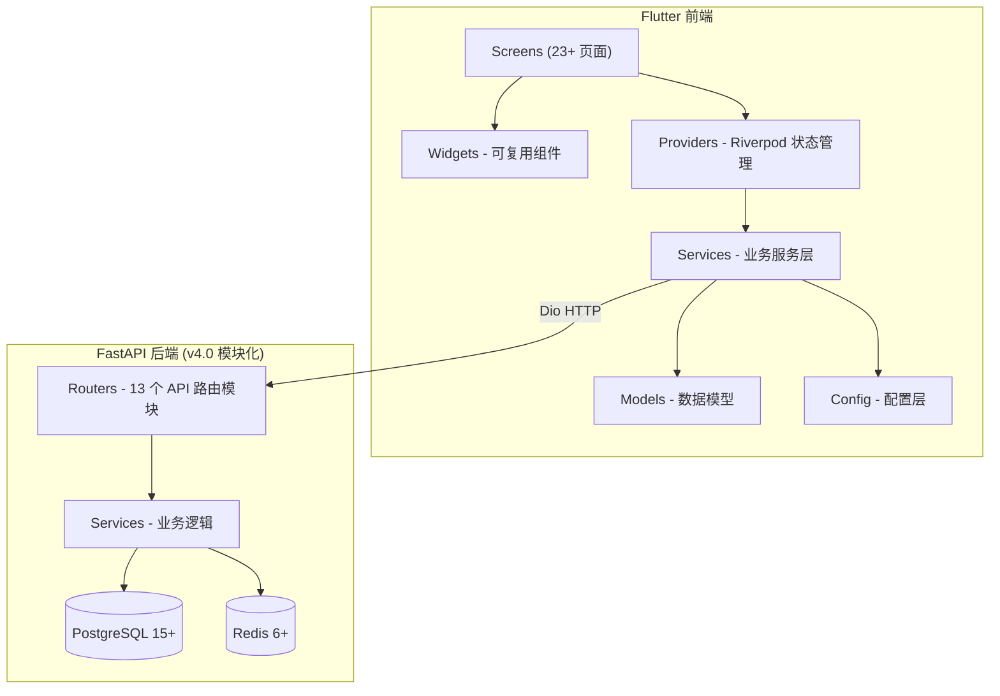
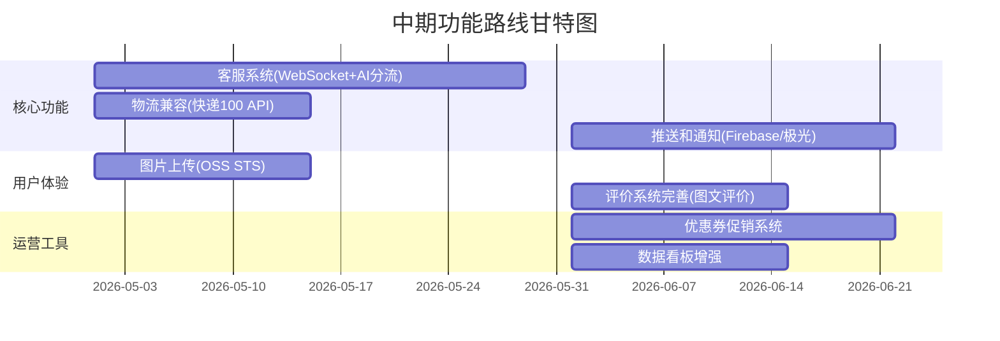
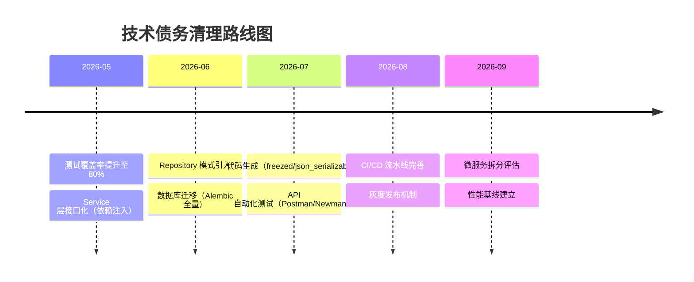
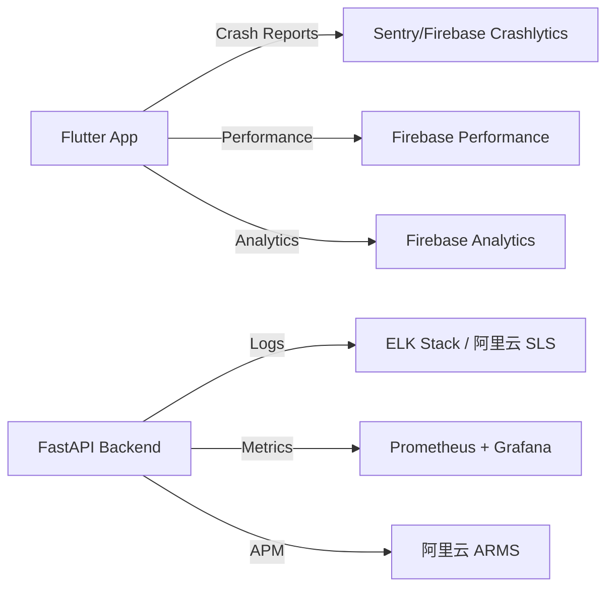

# 汇玉源（HuiYuYuan）企业级电商项目 — 全面代码质量审查与开发路线图

> **审查日期**：2026-03-25（持续更新）
> **审查人**：资深 Flutter 开发工程师
> **项目版本**：v4.0（模块化架构已完成）
> **技术栈**：Flutter 3.27+ / Dart 3.6+ / FastAPI / PostgreSQL / Redis / DashScope

---

## 一、最新进度更新（按时间倒序）

### 📋 2026-03-23 进度更新（Admin 拆分 / 本地 API）

| 类别 | 完成内容 |
|------|---------|
| Admin UI 拆分 | 新增 `lib/widgets/admin/admin_operator_tab.dart`；`admin_dashboard.dart` 将商品管理和操作员管理提取为独立 Widget，不再内嵌大块逻辑 |
| 旧代码清理 | 从 `lib/repositories/user_data_repository.dart` 删除遗留注释的商品搜索 API；从 `admin_dashboard.dart` 移除旧版内联商品/操作员管理实现 |
| 本地 API 访问 | `api_config.dart` 在本地桌面 Debug 下回退到 `http://127.0.0.1:8000`，在 Android Debug 下回退 `http://10.0.2.2:8000`；本地 `.env.json` 已设为 `USE_MOCK_API=false` |
| Admin API 兼容 | `api_config.dart`、`admin_models.dart`、`admin_repository.dart` 已匹配当前后端路由（`/api/admin/dashboard`、`/api/admin/activities`），补货建议从本地 catalog 推导，不再调用缺失的后端接口 |
| OpenRouter 兼容 | `ai_openrouter_service.dart` 强制使用 ASCII-safe Header 值，解决 Windows 下含中文应用名引发的 `Invalid HTTP header field value` 错误；默认模型切换为 `google/gemma-3-27b-it:free` |
| 运行验证 | 本地后端健康检查通过（`GET /api/health`），登录与商品 API 从 `127.0.0.1:8000` 成功响应 |
| 测试覆盖 | 新增 `test/widgets/admin/admin_operator_tab_test.dart`；Flutter 测试套件从 446 提升至 **449 / 449 全部通过** |

> 下一优先级：继续将 Admin Dashboard 过大模块拆分为独立 Widget/Provider，分离 API 驱动的操作员报告与演示性占位展示。

---

### 📋 2026-03-23 进度更新（AI 在线配置 / API 诊断 / UTF-16 修复）

| 类别 | 完成内容 |
|------|---------|
| 本地调试配置 | 新增 `local_debug_config.dart` 三件套（io/stub），Windows/Android Studio 本地调试环境自动尝试读取仓库根目录或 `.env.json`，支持 `OPENROUTER_API_KEY`、`API_BASE_URL`、`USE_MOCK_API` 三个调试入口 |
| AI 配置诊断 | `app_config.dart`、`ai_openrouter_service.dart`、`ai_service.dart` 已补齐 OpenRouter Key 来源追踪、placeholder 校验、缺失/无效 Key 明确报错；切至离线底部前会先输出真实原因 |
| API 网络诊断 | `api_config.dart` 和 `api_service.dart` 已支持本地覆盖 API base URL，并将 `DioExceptionType.unknown` 细化为超时/拒绝连接/主机不可达等可读错误 |
| UTF-16 崩溃修复 | 新增 `text_sanitizer.dart`，在 `chat_message_model.dart`、`storage_service.dart`、`ai_service.dart`、`ai_assistant_screen.dart` 等7处统一接入，避免 `TextSpan` 的 `string is not well-formed UTF-16` 崩溃 |
| 测试补强 | 新增 `text_sanitizer_test.dart`、`chat_message_model_test.dart` 等；Flutter 全量测试数从 437 提升至 **445 / 445 全部通过** |

---

### 📋 2026-03-22 进度更新（Runtime 写路径下沉）

| 类别 | 完成内容 |
|------|---------|
| 运行态单例 | 新增 `product_runtime_store.dart`，将共享 `seedProductData` 和 `productRuntimeCatalog` 从 `product_data.dart` 抽离，供 Repository / Service 复用 |
| Repository 写能力 | `product_catalog_repository.dart` 新增完整的 local runtime 读写接口（list/save/create/update/delete/reset） |
| Service / Admin 收口 | `product_service.dart` 在 `useMockApi` 下改为走 runtime catalog repository；`admin_repository.dart` 的商品列增删改统一委托 `ProductService` |
| 测试补强 | `product_service_test.dart` 新增 3 个 mock/runtime 写路径用例；Flutter 全量测试数从 423 提升至 426 |

---

### 📋 2026-03-20 - 2026-03-22 进度更新（多轮重构）

| 日期 | 类别 | 要点 |
|------|------|------|
| 2026-03-22 | Flutter 商品 seed 生成化 | 新增 `product_seed_generated.dart`，由共享 JSON 自动生成；旧常量表改为薄适配层 |
| 2026-03-22 | 共享 seed JSON 落库 | 新增 `backend/data/product_seed_payloads.json`，123 条，含 `seed_id`/`sort_order` 元数据 |
| 2026-03-22 | 后端 seed 源退场 | `seed_products.py` 已从手写 23 条 Python 常量退为共享 JSON 适配层 |
| 2026-03-22 | 商品 DTO / Repository 收口 | 新增 `ProductUpsertRequest`；后端商品新增/编辑链路不再传 `Map<String, dynamic>` |
| 2026-03-22 | ai_service 多轮拆分 | `ai_service.dart` 从 791 行收缩到 223 行；分析/合规/评估→`AIInsightService`，提示词/离线模板→`AIPromptService`，OpenRouter 客户端→`AIOpenRouterService`，商品上下文→`AIProductContextService` |
| 2026-03-21 | login_screen 文件级拆分 | `login_screen.dart` 从 1037 行压缩到 320 行；外壳组件/三角色表单迁入 `widgets/login/` |
| 2026-03-20 | main.dart 拆分 | `main.dart` 从 617 行压缩到 50 行；`HuiYuYuanApp`/路由/启动页/错误页迁入 `lib/app/` |
| 2026-03-20 | 严格类型修复 | 开启 `strict-casts: true`、`strict-raw-types: true`，完成 262 处类型修复 |
| 2026-03-19 | 代码规范基线 | `dart fix --apply` 自动修复 75 处；手工收数 24 处；`flutter analyze` 达到 `0 issue` |

---

## 二、整体架构评审

### 2.1 系统架构图



**优点：**
- ✅ **Riverpod 状态管理**：`AsyncNotifier` 模式，支持异步状态管理
- ✅ **分层清晰**：Screens → Providers → Services → Models 职责分明
- ✅ **多角色支持**：Customer / Operator / Admin 三角色独立页面集
- ✅ **Mock/API 双模式**：`useMockApi` 开关支持开发/生产切换
- ✅ **后端模块化**：FastAPI v4.0 采用 `routers/services/schemas` 独立模块

**待改进：**
> 缺少统一路由管理方案（当前使用 `Navigator.push` 直接跳转，缺少统一路由管理，如 `go_router` 或 `auto_route`，对于 23+ 页面的应用这会导致路由逻辑分散，深链接难以实现）

### 2.2 设计模式评估

| 模式 | 使用情况 | 评价 |
|------|---------|------|
| **单例模式** | ApiService、StorageService 等服务层 | ✅ 服务单例化避免重复创建 |
| **Provider 模式** | Riverpod `AsyncNotifier` | ✅ 状态管理集中规范 |
| **Repository 模式** | 部分采用（UserData/Payment/Notification/Admin） | ⚠️ 仍有部分模块 Service 直连数据访问 |
| **依赖注入** | 部分采用（Riverpod 自动管理） | ⚠️ 测试时 Service 层难以 mock |
| **Builder 模式** | Theme 构建 | ✅ 主题系统规范整洁 |

---

## 三、代码质量与测试覆盖分析

### 3.1 静态分析结果

```
flutter analyze 结果: 0 issues
├── 🔴 Errors:   0
├── 🟡 Warnings: 0
└── ℹ️  Info:     0
```

**已完成的清理工作：**

| 类型 | 结果 | 说明 |
|------|------|------|
| 自动修复 | 75 处 | `prefer_const*`、import、字符串提取、spread、`final`、大括号等 |
| 手工修复 | 24 处 | `dangling_library_doc_comments` 和测试局部变量命名问题 |
| 严格类型修复 | 262 处 | 开启 `strict-casts`/`strict-raw-types` 后，完成模型/服务/列表/静态/测试类型收数 |

### 3.2 测试覆盖情况（当前 v4.0）

```
flutter test 结果: 449 通过 / 0 失败
├── 通过率: 100%
└── 总测试数: 449
```

| 层级 | 测试文件 | 来源文件数 | 覆盖情况 |
|------|--------|-----------|---------|
| **Models** | 2（user_model_test、payment_account_test） | 11 | ⚠️ ~18% |
| **Services** | 10（api/ai/ai_product_context/backend/order/product/storage/address/payment/admin） | 21 | ✅ ~48% |
| **Providers** | 3（auth/cart/payment） | 5 | ⚠️ 60% |
| **Screens** | 5（cart/checkout/login/order_list/product_list） | 23+ | ⚠️ ~22% |
| **Integration** | 3（ai_chat/login/shopping） | — | ✅ 核心链 |
| **L10n** | 1（l10n_provider_test） | 2 | ✅ 50% |
| **Widget** | 2（widget_test + admin_operator_tab_test） | — | ⚠️ 基础 |
| **Data** | 4（product_seed/runtime_catalog/seed_generated/snapshot） | — | ✅ |

> [!IMPORTANT]
> **当前状态**：上一轮遗留的 44 个测试失败项已清零，现为 `449 / 449` 全量通过。

**关键受益模块：**
- `login_flow_test.dart`：登录集成链路已稳定
- `auth_provider_test.dart`：认证状态下本地准特殊流回退路径已验证
- `product_service_test.dart`：商品兼容在 Mock/离线回退点下可测
- `order_service_test.dart`：本地订单状态表达直接可查

---

## 四、安全性审查

### 4.1 安全问题清单

| 状态 | 问题 | 文件 | 影响 |
|------|------|------|------|
| ✅ **已修复** | OpenRouter Key 不再源码硬编码 | `config/secrets.dart` | 改为编译期注入，不再入库 |
| ✅ **已修复** | Debug 本地准特殊回退范围已限定 | `config/app_config.dart` | 仅非 Release 构建启用，Release 完全禁用 |
| ✅ **已修复** | 调试模式开关硬编码 | `config/app_config.dart` | 已改为基于构建模式判断 |
| 🟡 **待完成** | 生产 HTTPS 与证书状态需外部配置 | 部署配置 / `api_config.dart` | 代码已切到 HTTPS 域名，部署侧证书验证不在本轮 |
| 🟡 **待完成** | Web 平台 Token 在非安全上下文仍可回退到 SharedPreferences | `services/storage_service.dart` | HTTP / 非安全上下文下仍有明文存储隐患 |
| 🔵 **低优先级** | 缺少 SSL Pinning | `api_service.dart` | 当前仅 CA 证书验证 |

> [!IMPORTANT]
> **✅ 源码密钥问题已收数**
> 当前仓库中的密钥读取已改为 `String.fromEnvironment(...)`，不再保留真实 OpenRouter Key 常量。
>
> **🟡 本地准特殊回退仅用于开发/测试**
> 通过 `allowLocalCredentialFallback => !kReleaseMode` 控制，仅在 Debug/Test 构建下用于 API 不可用时兜底登录，Release 构建完全禁用。

### 4.2 安全性优化

- ✅ **JWT + bcrypt**：后端采用 JWT 认证 + bcrypt 密码哈希
- ✅ **flutter_secure_storage**：原生平台使用加密存储 Token
- ✅ **Token 刷新防循环**：`_refreshRetryCount` 限制最多 2 次刷新重试
- ✅ **CORS 白名单**：后端配置 CORS 允许来源
- ✅ **Redis 限流**：短信发送限流（60s 冷却 + 日 10 次/5 次错误锁定）
- ✅ **隐私合规弹窗**：首次启动强制显示隐私协议，用户同意后才初始化

---

## 五、性能优化分析

### 5.1 UI 渲染性能

| 项目 | 状态 | 说明 |
|------|------|------|
| `const` 使用 | ⚠️ 约 85 处可优化 | 大量构造函数未使用 `const` |
| 图片缓存 | ✅ | `cached_network_image` + `memCacheWidth: 800` |
| 列表性能 | ✅ | 使用 `ListView.builder` 懒加载 |
| 骨架屏 | ✅ | `shimmer` 骨架屏加载提升体验 |
| 动画控制器 | ✅ | 正确 dispose `AnimationController` |
| 字体缩放 | ✅ | `TextScaler.noScaling` 限制字体缩放 |

### 5.2 内存管理

| 项目 | 状态 | 说明 |
|------|------|------|
| 单例服务 | ✅ | Service 层单例避免重复创建 |
| 聊天历史限制 | ✅ | 最多保存 200 条 |
| 浏览记录限制 | ✅ | 最多保存 50 条 |
| 搜索历史限制 | ✅ | 最多保存 20 条 |
| 状态更新优化 | ✅ | `postFrameCallback` 避免每帧里超频 rebuild |

### 5.3 网络性能

| 项目 | 状态 | 说明 |
|------|------|------|
| 超时配置 | ✅ | 连接 15s / 接收 30s / 上传 120s |
| Token 自动注入 | ✅ | 拦截器自动添加 Authorization |
| 错误重试 | ⚠️ | 仅 401 Token 刷新有重试，其他错误无重试 |
| 请求缓存 | ❌ | 无离线缓存或请求去重机制 |
| 图片 CDN | ❌ | 使用 Unsplash/picsum 外部链接 |

### 5.4 性能优化建议

> [!TIP]
> **优先修复的性能问题**
> 1. 批量添加 `const` 到约 85 处构造函数（仅限非动态化处）
> 2. 替换 `withOpacity()`、`Color.fromRGBO()` 为 `Color` 常量（已被 Dart 废弃，但已 ignore）
> 3. 为 API 请求添加请求去重/缓存（`dio_cache_interceptor`）
> 4. 将商品图片迁移至阿里云 OSS CDN

---

## 六、可维护性评估

### 6.1 代码模块化

| 目录 | 文件数 | 评价 |
|------|-------|------|
| `lib/config/` | 4 | ✅ 配置独立且合理 |
| `lib/models/` | 11 | ✅ 模型定义清晰 |
| `lib/providers/` | 5 | ✅ 状态管理集中 |
| `lib/services/` | 21 | ✅ AI 服务已完成四层分层（Insight/Prompt/OpenRouter/ProductContext） |
| `lib/screens/` | 23+ | ✅ `login_screen.dart` 已收缩到 320 行，主要页面层结构明显下降 |
| `lib/widgets/` | 8+ | ✅ 可复用组件，`widgets/login/` 已承接登录页拆分结果 |
| `lib/themes/` | 2 | ✅ 主题系统完善 |
| `lib/l10n/` | 2 | ✅ 国际化支持 |
| `lib/data/` | 5 | ⚠️ 大量静态商品数据应迁移至后端 |

### 6.2 文档完整性

| 文档类型 | 状态 | 文件 |
|---------|------|------|
| 项目主 README | ✅ | `CLAUDE.md` + `docs/README.md` |
| 任务清单 | ✅ | `docs/planning/task.md` |
| v4.0 总体规划 | ✅ | `docs/planning/v4_master_plan.md` |
| 部署指南 | ✅ | `docs/guides/deployment_guide_updated.md` |
| AI 服务指南 | ✅ | `docs/guides/ai_service_guide.md` |
| 快速启动指南 | ✅ | `docs/guides/快速启动指南.md` |
| API 文档 | ⚠️ | 后端有自动 Swagger，但无独立文档 |
| 测试策略文档 | ❌ | 暂无 |
| 代码注释 | ✅ | 中文注释覆盖率约 80% |

### 6.3 技术债务清单

> [!WARNING]
> **当前技术债务（按严重程度排序）**
> 1. 🟡 **130 款商品数据仍在前端静态文件中**：`product_data.dart` + `product_data_extended.dart` 应迁移至数据库
> 2. 🟡 **静态商品 seed 已补齐 catalog/payload 层，但原始常量仍留逃逸层**：下一步应继续迁到 JSON/SQL/后端 seed 文件
> 3. 🔵 **ai_service.dart 剩余协调逻辑可后续演进**：分析/合规/评估、提示词/离线模板、OpenRouter 客户端、商品上下文服务均已迁出，剩余主要是会话编排与业务协调
> 4. 🔵 **login_screen.dart 仍有少量页面协调逻辑可继续拆分**：当前已收缩到 320 行，后续可评估验证码弹窗、列表侧测提示与状态排是否继续独立
> 5. 🟡 **缺少统一路由管理方案**：仍使用 `Navigator.push` 直接跳转，建议评估 `go_router`
> 6. 🔵 **HTTPS / SSL Pinning / Web Token 安全兜底仍待跟齐**：属于部署和安全迭代项

---

## 七、综合评级

| 维度 | 评级 | 说明 |
|------|------|------|
| **架构设计** | ⭐⭐⭐⭐（B+） | Riverpod + 分层架构合理，主入口和登录页已完成结构拆分，`ai_service.dart` 已完成四轮服务拆分，商品编辑请求也已完成 DTO 收口，当前银额进一步收数到商品服务剩余边界与静态商品数据正式迁移 |
| **代码规范** | ⭐⭐⭐⭐⭐（A） | 0 个 lint issues（0 error, 0 warning, 0 info） |
| **测试覆盖** | ⭐⭐⭐⭐（B+） | 27 个测试文件，449 通过 / 0 失败（100% 通过率） |
| **安全性** | ⭐⭐⭐（B） | 源码密钥已移除，Debug 回退点仅非 Release 可用，仍需 HTTPS/SSL 配套 |
| **性能** | ⭐⭐⭐⭐（B+） | 主题/动画设置合理，但存在 `withOpacity` 等性能隐患 |
| **可维护性** | ⭐⭐⭐⭐（B+） | 注释完整，模块化较好，部分文件过大 |
| **上线就绪率** | 🔥 88% | 待域名HTTPS/支付接入/阿里云 SMS 资质/Android 签名 |

---

## 八、开发路线图

### 阶段一：短期优化（1-2 个月，内部测试上线）

#### 第 1 周：紧急测试修复（2026-03-19 ~ 2026-03-25）✅ 已完成

| 任务 | 优先级 | 工时 | 说明 |
|------|-------|------|------|
| 移除 `secrets.dart` 中硬编码 API Key | P0 | 2h | 改为纯 `--dart-define` 注入 |
| 修复 `use_build_context_synchronously` | P0 | 1h | `product_detail_screen.dart:675` |
| 调整调试登录回退策略 | P0 | 0.5h | 改为仅非 Release 构建本地准特殊流回退点 |
| 配置域名 + HTTPS（Let's Encrypt） | P0 | 4h | `api.huiyuyuan.com` |
| 构建 Release APK 内部分发 | P0 | 2h | 签名密钥 + Release 构建 |

#### 第 1 周：测试修复 + 代码清理（2026-03-26 ~ 2026-04-01）

| 任务 | 优先级 | 工时 | 说明 |
|------|-------|------|------|
| 商品数据迁移至数据库 | P1 | 6h | 130 款数据落库，前端改为 API 拉取 |
| 购物车/订单/收藏数据云端化 | P1 | 12h | 替换本地 SharedPreferences |
| 支付系统对接（微信/支付宝） | P1 | 16h | 后端签名 + 前端调用 |
| 统一错误处理机制 | P2 | 6h | `ApiException` 全局拦截 |
| 页面路由管理重构（go_router） | P2 | 8h | 声明式路由 + 深链接支持 |

#### 第 4 周：核心功能补充（2026-04-02 ~ 2026-04-15）

| 任务 | 优先级 | 工时 | 说明 |
|------|-------|------|------|
| 阿里云短信服务接入 | P1 | 8h | 替换万能验证码 8888 |
| 图片上传完善 | P1 | 6h | `image_picker` 接入 + 阿里云 OSS |
| 内测反馈收集 + Bug 修复 | P1 | 持续 | 内部 3-5 人使用测试 |

#### 第 8 周：体验优化 + 内测（2026-04-16 ~ 2026-05-15）

| 任务 | 优先级 | 工时 | 说明 |
|------|-------|------|------|
| 接入 Firebase Crashlytics | P1 | 4h | 生产崩溃监控 |
| 性能优化（const/CDN/缓存） | P2 | 8h | 参见 5.4 节建议 |

---

### 阶段二：中期计划（3-6 个月）



| 功能 | 描述 | 技术要点 |
|------|------|---------|
| **实时客服系统** | WebSocket 聊天 + AI 自动分流 | 后端 `/ws/chat` + Redis Pub/Sub |
| **物流追踪** | 快递 100 接口 + 状态推送 | 快递 100 API + 后端轮询 |
| **图片上传** | 用户上传商品图、评价图 | 阿里云 OSS STS 临时凭证 |
| **推送和通知** | 订单状态变更推送 | Firebase/极光推送 |
| **优惠券系统** | 满减/折扣/新人券 | 后端 coupons 表 + 前端使用 |

---

### 阶段三：长期技术演进（7-12 个月）

#### 1. 技术债务清理计划



#### 2. 架构升级方案

| 升级项 | 当前状态 | 建议状态 | 预期收益 |
|--------|---------|---------|---------|
| **路由管理** | `Navigator.push` | `go_router` 声明式 | 深链接、路由守卫 |
| **序列化** | 手动 `fromJson/toJson` | `freezed` + `json_serializable` | 类型安全、代码生成 |
| **Service 层** | 具体类单例 | 接口 + 依赖注入 | 可创建测试 mock |
| **状态管理** | Riverpod 基础版 | Riverpod + CodeGen | 编译时类型安全 |
| **离线支持** | 暂无 | `drift` 本地数据库 | 离线可用 |
| **监控** | `print` 日志 | 结构化日志 + Sentry | 生产可观测性 |

#### 3. 技术选型演进建议

| 当前 | 建议 | 原因 |
|------|------|------|
| `dio` 5.4 | 保持 | 成熟稳定 |
| `shared_preferences` | 保持（简单数据），考虑 `drift`（复杂数据结构） | 结构化离线存储 |
| `flutter_secure_storage` | 保持 | 安全存储最佳实践 |
| 手动 JSON | `freezed` + `json_serializable` | 消除手写序列化错误 |
| `Navigator` | `go_router` | 官方推荐声明式路由 |
| 无监控 | `sentry_flutter` + Firebase Analytics | 生产问题追踪 |
| 无代码生成 | `build_runner` + Riverpod annotations | 编译时类型安全 |

---

### 质量保障体系

#### 测试金字塔策略

```
          △
         ╱ ╲        E2E/集成测试 (10%)
        ─────     ← flutter_driver / integration_test
       ╱     ╲      Widget 测试 (30%)
     ─────────   ← flutter_test + golden tests
    ╱           ╲   单元测试 (60%)
  ───────────────← mockito + test
```

| 测试类型 | 当前覆盖 | 建议目标 | 工具 |
|---------|---------|---------|------|
| **单元测试** | ~40% | 80% | `test`、`mockito` |
| **Widget 测试** | ~15% | 50% | `flutter_test`、golden tests |
| **集成测试** | ~10%（3 个） | 30% | `integration_test` |
| **E2E 测试** | 0% | 核心流程 | `patrol` 或 `maestro` |

#### 优先测试的模块

1. **Service 层**：[ApiService](file:///d:/huiyuyuan_project/huiyuyuan_app/lib/services/api_service.dart)、[StorageService](file:///d:/huiyuyuan_project/huiyuyuan_app/lib/services/storage_service.dart)、`PaymentService`——核心业务逻辑
2. **Provider 层**：[AuthNotifier](file:///d:/huiyuyuan_project/huiyuyuan_app/lib/providers/auth_provider.dart)、`CartProvider`——状态管理验证
3. **Widget 层**：`LoginScreen`、`CheckoutScreen`、`ProductDetailScreen`——核心交互流程
4. **集成测试**：完整支付购物流程、登录流程、AI 对话流程

#### 性能监控方案



**分阶段实施：**
- **立即（零成本）**：`flutter_secure_storage` 已有；接入 Firebase Crashlytics；后端结构化日志
- **内测后（中低成本）**：接入 Sentry Flutter SDK；核心指标埋点（页面加载时间/API 响应时间/购物转化率）
- **正式上线（中等成本）**：用户行为分析；A/B 测试框架；后端 APM

---

## 九、风险评估

| 风险 | 概率 | 影响 | 缓解措施 |
|------|------|------|---------|
| HTTPS / 证书未配置 | 🟡 中 | 🔴 高 | 完成域名注册和证书验证与证书继续配套配置 |
| 支付资质延迟 | 🟡 中 | 🔴 高 | 先上线商品展示，支付后补 |
| 阿里云短信服务营业执照审核 | 🟡 中 | 🟡 中 | 保留万能验证码 8888 开发模式 |
| 服务器单点故障 | 🔵 低 | 🟡 中 | 当前 2 核/GB，内测够用，后扩容 |
| Flutter 版本兼容性 | 🔵 低 | 🔵 低 | 锁定 SDK >=3.0.0 <4.0.0 |

---

## 十、立即行动清单（内部上线前必须）

> [!IMPORTANT]
> **🚀 立即行动清单（内部上线线前必须，当前优先处理）**

### 🟡 本轮计划（内部测试及上线前）

1. ✅ 已完成：打通 Mock 模式和离线回退测试链路（认证/商品/订单测试已实现 `449 / 449` 全部通过）
2. ✅ 已完成：修复 15 处 `avoid_print`（统一改为 `debugPrint` 或移除）
3. ✅ 已完成：清理 133 个 lint issues（`flutter analyze` 已达到 `No issues found`）
4. ✅ 已完成：开启严格类型严格并完成 262 处类型修复
5. ✅ 已完成：用户数据边界首轮收口（新增 `UserDataRepository` + DTO）
6. ✅ 已完成：支付账户和通知边界收口（新增 `PaymentAccountRepository` / `NotificationRepository`）
7. ✅ 已完成：后台统计边界收口（新增 `AdminRepository` + `admin_models.dart`）
8. ✅ 已完成：支付网关响应边界收口（新增 `PaymentRepository` + 支付 DTO）
9. ✅ 已完成：login_screen 组件化与转轮准绳
10. ✅ 已完成：ai_service 多轮服务拆分（从 791 行收缩至 223 行）
11. ✅ 已完成：商品编辑 DTO / Repository 收口
12. ✅ 已完成：静态商品目录边界收口

### 📋 内测期间持续优化

1. 🔄 商品数据迁移至数据库（130 款数据落库）
2. 🔄 阿里云短信服务资质办理
3. 🔄 支付系统对接（微信/支付宝）
4. 🔄 接入 Firebase Crashlytics 监控

---

*文档最后更新：2026-03-25*
*基于 docs/ 全量文档与代码库最新状态重建，原文件因 GBK 编码损坏已修复为 UTF-8*
