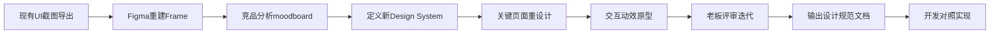

# 汇玉源 UI "去 AI 化" 深度优化实操指南

> **背景**：针对老板提出的“UI AI 味太重”的反馈，本文件提供一套从视觉到交互的深度优化方案。  
> **核心目标**：摆脱 Material Design 默认感，建立具有珠宝行业属性的“温润、通透、奢华”品牌视觉。  
> **最后更新**：2026-04-11

---

## 🎨 核心问题诊断：什么是“AI 味”？

在开始优化前，我们需要明确老板口中的“AI 味”通常指代以下六个维度的缺失：

1.  **组件过于通用**：按钮、输入框像 Android 系统自带，缺乏定制圆角和阴影。
2.  **色彩搭配机械**：品牌色（翡翠绿）使用生硬，缺少透明度层次和渐变光泽。
3.  **动效缺失或生硬**：页面跳转只有简单的位移，缺乏物理世界的惯性或弹性。
4.  **排版缺乏节奏**：字号、行高、间距过于均匀，没有视觉焦点和呼吸感。
5.  **图标风格不统一**：混用了多种 Icon 库，线条粗细不一，端点尖锐。
6.  **微交互贫乏**：点击、悬停、加载时的反馈单调，缺乏情感化设计。

---

## 方案一：Figma 重设计 (专业级·推荐 ⭐⭐⭐⭐⭐)

此方案通过专业的 UI 设计流程，对核心页面进行“手术刀式”的重构。虽然前期投入较大，但能从根本上确立品牌调性。

### 1.1 为什么选 Figma？
*   **零代码成本**：设计师独立完成，开发后期对照实现，不影响现有业务逻辑。
*   **快速迭代**：拖拽调整，实时预览，老板可直接在 Figma 评论区参与评审。
*   **设计系统沉淀**：建立 Component Library，后续新增页面只需调用组件。
*   **交付规范**：自动生成 Design Token (JSON)，降低开发还原误差。

### 1.2 Figma 工作流程



### 1.3 具体执行步骤

#### Step 1: 建立 Figma 项目结构

建议在 Figma 中按以下目录组织文件：

```
汇玉源UI 2.0/
├── 📁 Cover (封面页)
├── 📁 Moodboard (情绪板)
│   ├── 竞品参考(周大福/六福珠宝/Tiffany App截图)
│   ├── 灵感收集 (Dribbble/Pinterest珠宝类设计)
│   └── 色彩情绪图
├── 📁 Design System (设计系统)
│   ├── Colors (色彩体系)
│   ├── Typography (字体层级)
│   ├── Components (组件库)
│   │   ├── Buttons (7种变体)
│   │   ├── Cards (5种卡片)
│   │   ├── Inputs (表单控件)
│   │   └── Navigation (导航组件)
│   └── Icons (定制图标集)
├── 📁 Key Screens (关键页面)
│   ├── Login (登录页重构)
│   ├── Home (首页改版)
│   ├── Product Detail (商品详情)
│   ├── Cart (购物车优化)
│   └── AI Chat (对话界面焕新)
├── 📁 Prototypes (交互原型)
│   ├── 页面跳转流程
│   └── 微交互动画
└── 📁 Handoff (交付物)
    ├── Design Token JSON
    └── 切图资源
```

#### Step 2: 去“AI味”的设计策略

##### 1. 色彩体系升级
**当前问题**：翡翠绿 `#2E8B57` 使用过于直接，缺少渐变和透明度层次。

**优化方案**：
*   **主色阶扩展**：
    *   `Emerald 50`: `#ECFDF5` (背景底色)
    *   `Emerald 100`: `#D1FAE5` (悬浮态)
    *   `Emerald 500`: `#10B981` (主按钮)
    *   `Emerald 600`: `#059669` (Hover态)
    *   `Emerald 700`: `#047857` (Active态)
    *   `Emerald 900`: `#064E3B` (深色文字)
*   **辅助色**：
    *   `Gold Accent`: `#D4AF37` → 调整为渐变色 `Linear Gradient: #F4E4BC → #D4AF37 → #B8941F`
*   **背景色**：
    *   `Dark BG`: `#0D1B2A` → 增加纹理感（叠加 2% 噪点图层 + 径向渐变光晕）

**Figma 操作**：创建 Color Styles，命名规范为 `Color/Emerald/500`；使用 Gradient Tool 制作金色渐变。

##### 2. 字体层级重塑
**当前问题**：字号跳跃不够明显，缺少视觉焦点。

**优化方案**（采用 Major Third 1.25 倍率）：
*   **Display**: 32px / Bold (页面标题)
*   **H1**: 24px / SemiBold (模块标题)
*   **H2**: 20px / Medium (卡片标题)
*   **Body**: 16px / Regular (正文)
*   **Caption**: 14px / Regular (辅助说明)
*   **Small**: 12px / Regular (标签/角标)

**行高优化**：标题 1.2 倍，正文 1.5 倍（提升可读性），紧凑列表 1.3 倍。

##### 3. 组件个性化改造
*   **毛玻璃效果升级**：
    *   Blur: 20px (更强模糊)
    *   Background: `rgba(255,255,255,0.08)`
    *   Border: 1px solid `rgba(255,255,255,0.15)`
    *   Shadow: Outer `0 8px 32px rgba(0,0,0,0.2)` + Inner `inset 0 1px 0 rgba(255,255,255,0.1)`
*   **按钮改造**：
    *   Primary: 线性渐变背景 + 投影 `0 4px 12px rgba(16,185,129,0.3)`
    *   Secondary: 透明背景 + 2px 绿色描边

##### 4. 引入有机形状打破僵硬
*   **装饰元素**：背景添加抽象玉石纹理 SVG (opacity 5%)，页面角落加入柔和曲线分割线。
*   **图标风格**：统一使用 Rounded Line Icons (2px 描边，圆角端点)。

##### 5. 情感化微交互设计
*   **点赞/收藏**：点击时心形图标放大 1.3 倍后回弹，伴随金色粒子爆炸效果。
*   **AI 对话气泡**：对方消息从左滑入 + Fade In，Typing indicator 改为“三点跳动”。

#### Step 3: 竞品分析与 Moodboard
*   **传统珠宝**：周大福（稳重奢华）、Tiffany（极简蓝盒）。
*   **新兴电商**：得物（潮流社区）、小红书（瀑布流生活化）。
*   **AI 产品**：ChatGPT（简洁聚焦）、Character.ai（角色个性化）。

#### Step 4: 关键页面重设计示例

**登录页改造前后对比**：
*   **Before**：Logo 居中，标准 Material 输入框，纯色矩形按钮。
*   **After**：顶部金色波浪装饰线，带光泽渐变的 Logo，带图标的半透明输入框（聚焦发光），渐变按钮带 Shimmer 效果，第三方登录图标圆形化。

**AI 对话界面焕新**：
*   **Before**：普通白色/灰色气泡，简单输入框。
*   **After**：带头像和在线状态的 Header，玉石质感的 AI 头像，打字机效果逐字出现，用户气泡右对齐带渐变背景，底部增加“猜你想问”横向滚动 Chips。

#### Step 5: 输出设计规范文档
*   **Design Token JSON**：包含 color, spacing, radius, shadow 等数值。
*   **组件变体表**：列出 Button, Input, Card 的所有状态（Default, Hover, Pressed, Disabled 等）。
*   **切图资源**：SVG 图标集，PNG 启动图，Lottie 动画 JSON。

---

## 方案二：设计系统工具辅助 (效率级·快速见效 ⭐⭐⭐⭐)

如果时间紧迫，无法进行完整的 Figma 重设计，可以利用成熟的第三方设计工具和资源库进行“局部换血”。

### 2.1 推荐工具箱

| 工具名称 | 用途 | 推荐理由 |
| :--- | :--- | :--- |
| **Untitled UI** | Figma 基础套件 | 全球最完善的 Figma 库，提供极其细腻的间距和排版规范。 |
| **Haikei** | SVG 背景生成 | 免费生成有机波浪、斑点背景，瞬间打破纯色背景的单调。 |
| **Phosphor Icons** | 图标库 | 比 Material Icons 更圆润、更具现代感，支持双色风格。 |
| **Humaaans / Blush** | 插画系统 | 替换掉 Generic AI 生成的插图，定制化人物形象。 |
| **Relume Library** | Web 组件库 | 如果是 Web 端，直接复制其经过验证的营销区块布局。 |

### 2.2 快速落地动作
1.  **背景升级**：访问 Haikei，生成一组低透明度（5%）的翡翠绿波纹 SVG，作为所有页面的底层背景。
2.  **图标替换**：在 Flutter 项目中引入 `phosphor_flutter`，将所有 `Icons.xxx` 批量替换为 `PhosphorIcons.xxxDuotone`。
3.  **色彩微调**：在代码中将所有的纯色按钮背景改为线性渐变（LinearGradient），模拟光照效果。

---

## 方案三：设计评审工作坊 (协作级·共识驱动 ⭐⭐⭐)

此方案侧重于团队内部的认知对齐，通过集体智慧找出“AI 味”的具体来源，并低成本产出改进方案。

### 3.1 半天 Workshop 流程安排 (4小时)

#### 14:00 - 14:30 | 痛点挖掘 (The "Cringe" Test)
*   **动作**：将当前 App 的所有截图打印出来贴在墙上。
*   **互动**：每人发 5 个红色贴纸，贴在自己觉得“最像 AI 生成”、“最没质感”的地方。
*   **产出**：得票最高的 3 个页面即为本次优化的核心目标。

#### 14:30 - 15:30 | 竞品拆解与灵感众筹
*   **动作**：每个人拿出手机里觉得自己“最有质感”的 App。
*   **分享**：每人用 2 分钟解释为什么觉得它好（是字体大？留白多？还是动画顺滑？）。
*   **产出**：提炼出 3-5 个可立即借鉴的设计关键词（如：呼吸感、金属光泽、衬线体）。

#### 15:30 - 16:30 | Crazy 8s 速绘挑战
*   **动作**：拿出一张 A4 纸折成 8 格。针对得分最高的那个页面，大家在 8 分钟内画出 8 种不同的布局草图。
*   **规则**：不许思考细节，只画轮廓和核心元素位置。
*   **产出**：选出最具创意的 2 个草图进行深化。

#### 16:30 - 17:30 | 低保真原型走查
*   **动作**：在白板上或用 Balsamiq 快速画出选中的草图流程。
*   **角色扮演**：一人扮演用户，一人扮演系统，口头模拟操作流程。
*   **产出**：一份大家达成共识的《UI 优化行动清单》。

---

## 💡 总结与建议

| 方案 | 适用场景 | 优点 | 缺点 |
| :--- | :--- | :--- | :--- |
| **Figma 重设计** | 追求极致品牌感，有专职设计师 | 效果最好，系统性最强 | 耗时较长，成本高 |
| **工具辅助** | 开发主导，时间紧任务重 | 见效快，成本低 | 容易陷入“拼凑感” |
| **设计工作坊** | 团队对设计风格有分歧 | 凝聚共识，激发创意 | 需要较强的引导能力 |

**我的建议：**
先花 **1 小时** 搞一次小型的 **方案三（工作坊）**，明确老板到底讨厌哪些地方；然后利用 **方案二（工具辅助）** 里的 Haikei 和 Phosphor Icons 在一两天内做出一个“去 AI 化”的 Demo；如果老板满意这个方向，再考虑是否投入资源进行 **方案一（Figma 重设计）**。

---

## 📚 附录：Figma 学习资源

*   **零基础入门**：B站搜索"Figma教程 2024" (推荐UP主: 星范设计)
*   **进阶技巧**：Auto Layout 深度解析、Component Variants 最佳实践
*   **插件推荐**：Unsplash (免费高清图), Iconify (10万+图标), Content Reel (占位文本), Stark (无障碍检查)
